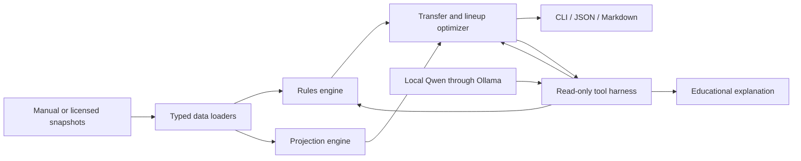

# FPL Agent

FPL Agent is a local-first, explainable learning project that recommends Fantasy Premier League
transfers, a starting XI, bench order, captain, and vice-captain. A local Qwen model can call the
read-only analysis tools through Ollama and explain the deterministic result.

> **MVP safety boundary:** this repository does not log in to FPL, scrape the FPL game, or submit
> account changes. It operates on manually supplied, user-owned, synthetic, or properly licensed
> snapshots and produces advice for a human to review.

The sample players and clubs are entirely fictional. This project is not affiliated with or endorsed
by the Premier League or Fantasy Premier League.

## What the MVP can do

- Validate a 15-player squad against versioned 2026/27 rules.
- Project player points over one to eight gameweeks.
- Understand blank and double gameweeks from the supplied fixture rows.
- Compare rolling a transfer with the best one- and two-transfer candidates.
- Account for available money, actual selling prices, free transfers, and point hits.
- Optimize a legal formation, captain, vice-captain, reserve goalkeeper, and bench order.
- Turn availability evidence into an explicit `transfer`, `bench`, or `start_with_risk` decision.
- Let a local `qwen3:8b` model select safe tools, then render their validated result.
- Produce Markdown and machine-readable JSON reports.

The MVP does not predict price changes, optimize chips, learn model weights from historical data,
or make account changes. Those are later milestones, described in [the roadmap](docs/10-roadmap.md).

## Quick start

Python 3.11 or newer is required. Ollama is optional for deterministic analysis and required only for
the `agent` command.

```bash
python3 -m venv .venv
source .venv/bin/activate
python -m pip install -e '.[dev]'
```

Validate the fictional learning squad:

```bash
fpl-agent validate
```

Generate the deterministic Gameweek 4 report:

```bash
fpl-agent recommend --gameweek 4 \
  --output reports/gameweek-4.md \
  --json-output reports/gameweek-4.json
```

Check the local model runtime and ask Qwen to use the tools:

```bash
fpl-agent doctor --model qwen3:8b
fpl-agent agent --gameweek 4 --model qwen3:8b
```

The model's free-form draft is suppressed because it is not a trustworthy data contract. Use
`--show-model-draft` only to study model behavior; the normal output is rendered from validated tool
results.

Run the quality checks:

```bash
pytest
ruff check .
```

## Architecture



The model is not the rules engine or the calculator. It decides which read-only tools to call and
explains their structured results. This is the project's most important design decision: stochastic
language generation is useful around deterministic domain logic, not in place of it.

Read [What is an agent?](docs/01-agentic-ai.md) and then the
[architecture walkthrough](docs/02-architecture.md) for a detailed tour.

## Use your own snapshots

Copy the files in `examples/` and replace the fictional values:

```bash
cp examples/team.yaml data/private/my-team.yaml
cp examples/players.csv data/private/my-players.csv
cp examples/fixtures.csv data/private/my-fixtures.csv
```

`data/private/` is ignored by Git. Keep the column names unchanged, use prices in millions such as
`7.5`, and record an evidence URL and timestamp for any availability claim. Then run:

```bash
fpl-agent recommend --gameweek 4 \
  --team data/private/my-team.yaml \
  --players data/private/my-players.csv \
  --fixtures data/private/my-fixtures.csv
```

The schemas and field meanings are explained in [Data and provenance](docs/03-data.md).

## Why account automation is excluded

The current FPL Terms state that participants must not use automated systems to access the game and
extract information. The interfaces used by the FPL website are also not a documented, stable public
developer API. Automating a browser would not remove that restriction.

For an open-source educational project, the responsible design is therefore:

1. Analyze manually supplied or properly licensed data.
2. Generate a complete, auditable recommendation.
3. Let the account owner review and apply the change in the official interface.
4. Develop any future write adapter only against a fake server unless written authorization is
   obtained.

References:

- [Official FPL game rules](https://fantasy.premierleague.com/help/rules)
- [Official FPL terms and conditions](https://fantasy.premierleague.com/help/terms)
- [Official Premier League website terms](https://www.premierleague.com/en/terms-and-conditions)
- [Qwen function-calling documentation](https://github.com/QwenLM/Qwen3/blob/main/docs/source/framework/function_call.md)
- [Ollama tool-calling documentation](https://github.com/ollama/ollama/blob/main/docs/capabilities/tool-calling.mdx)

## Learning path

The documentation is arranged as a small course:

1. [Learning plan](docs/00-learning-plan.md)
2. [Agentic AI fundamentals](docs/01-agentic-ai.md)
3. [System architecture](docs/02-architecture.md)
4. [Data and provenance](docs/03-data.md)
5. [FPL rules as code](docs/04-rules-engine.md)
6. [Expected-points modeling](docs/05-projections.md)
7. [Optimization](docs/06-optimization.md)
8. [The Qwen tool harness](docs/07-agent-harness.md)
9. [Safety and compliance](docs/08-safety.md)
10. [Testing and evaluation](docs/09-evaluation.md)
11. [Roadmap](docs/10-roadmap.md)
12. [Glossary](docs/glossary.md)

## Repository map

```text
FPL_Agent/
├── src/fpl_agent/       # Application code
├── rules/               # Season-versioned deterministic rule packs
├── examples/            # Fictional data safe to commit
├── tests/               # Executable behavior and safety checks
├── docs/                # The learning course
└── .github/workflows/   # Automated quality checks
```

## License

Source code is available under the [MIT License](LICENSE). No rights are granted to Premier League
data, names, badges, logos, or other third-party intellectual property.
