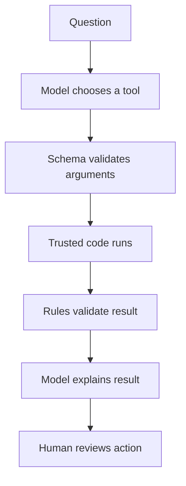

# Learning plan

## Goal

By completing this project you should be able to explain and build an agent as a controlled software
system—not merely as a prompt sent to a model.

## Suggested sequence

| Stage | Build | Main concept | Exercise |
|---|---|---|---|
| 1 | Run the fictional example | End-to-end data flow | Change one player's form and predict the effect |
| 2 | Read `models.py` and `data.py` | Typed tool contracts | Add a validated `suspension_games` field |
| 3 | Read `rules.py` | Deterministic guardrails | Write a test for four players from one club |
| 4 | Read `projection.py` | Forecasting under uncertainty | Plot expected points as availability changes |
| 5 | Read `optimizer.py` | Constrained decisions | Change the transfer option-value penalty |
| 6 | Read `agent.py` | Tool calling | Add a read-only tool for one player's projections |
| 7 | Run Qwen locally | Agent loop | Inspect which tools it chooses for two prompts |
| 8 | Read `evidence.py` | Trust boundaries and provenance | Create stale and conflicting claims |
| 9 | Read `providers/` | Least-privilege web research | Test an allowlisted fake response |
| 10 | Backtest a snapshot | Evaluation | Compare the agent with “always roll” |

## The mental model

At each arrow, ask:

- What information enters?
- Which component is trusted?
- How can it fail?
- What observable evidence would reveal the failure?

## Definition of learning success

You have learned the MVP when you can explain:

1. Why the LLM does not own the rules or optimizer.
2. Why a forecast and an optimization objective are different things.
3. How tool schemas reduce, but do not eliminate, model errors.
4. Why historical evaluation must respect the original gameweek deadline.
5. Why a technically accessible endpoint may still be inappropriate to automate.
6. Why a search result, an evidence observation, and a derived estimate are different objects.
7. How freshness, conflict, quarantine, and time-controlled replay make external data auditable.
