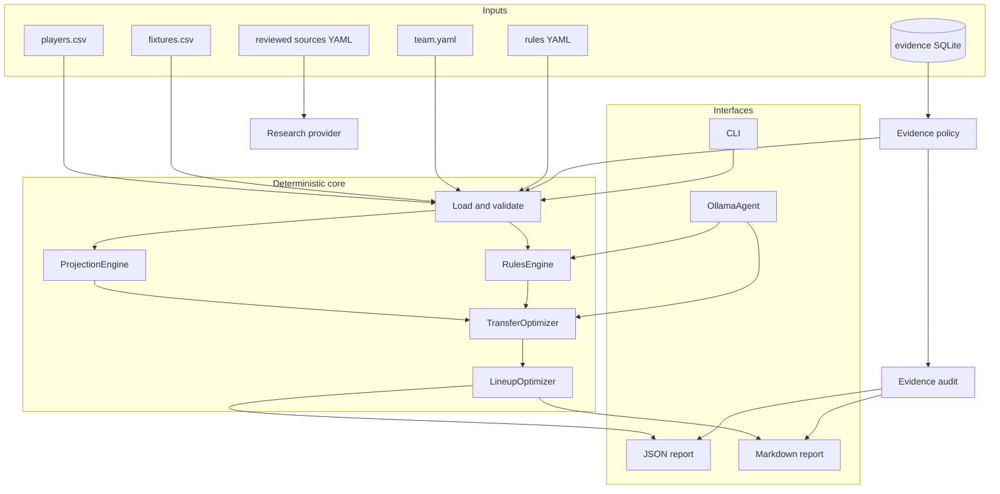
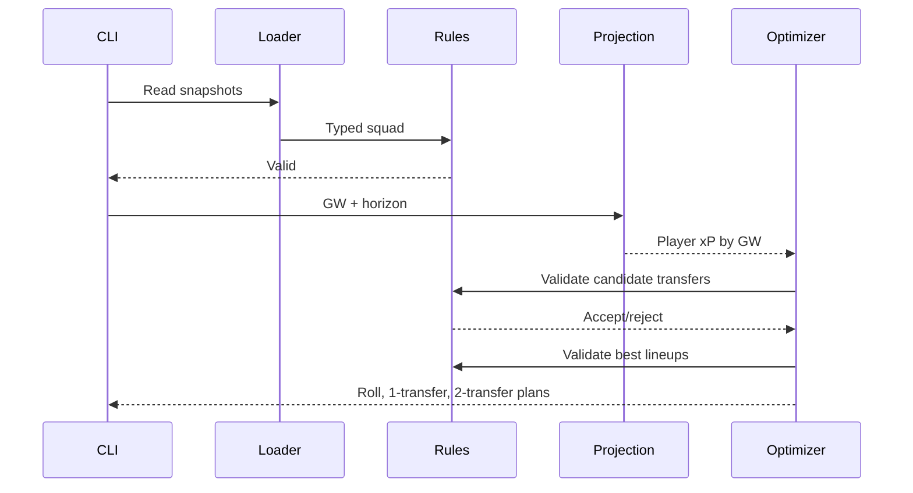

# System architecture

## Layers

## Dependency direction

The domain models are at the center and do not know about the CLI or Ollama. The optimizer knows about
rules and projections but not about HTTP. The agent calls application services rather than duplicating
their logic.

This makes four future changes independent:

- Replace the heuristic projection with a trained model.
- Replace bounded enumeration with a multi-period MILP solver.
- Replace Ollama with another OpenAI-compatible local runtime.
- Add another licensed discovery provider behind the small provider protocol.

## One deterministic recommendation

## One agent run

The agent is deliberately thin. It owns conversation state and the tool loop, while Python services
own facts and calculations. The registry exposes only five read-only tools, so even a malicious prompt
cannot cause an account change—the capability does not exist.

Evidence is resolved before that registry is built. Qwen sees only the policy-approved player view,
not quarantined search text or unresolved conflicting observations.

The source registry governs the separate research provider, not the agent. Its decision expires on a
date, while the recommendation's evidence audit captures the exact resolver decision for replay.
