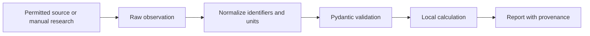

# Data and provenance

## Why input data is explicit

The MVP reads snapshots rather than silently collecting them. This keeps experiments reproducible,
makes the source of every claim visible, and avoids coupling the core to an undocumented website.



## Player CSV

| Field | Type | Meaning |
|---|---|---|
| `id` | integer | Stable identifier within your snapshot |
| `name` | text | Display name |
| `club` | text | Club identifier used by fixture rows |
| `position` | enum | `GK`, `DEF`, `MID`, or `FWD` |
| `price` | decimal | Current buying price in millions |
| `points_per_game` | number | Season or selected-window rate |
| `form` | number | Recent performance rate |
| `chance_of_playing` | 0–100 | Estimated probability of appearing |
| `expected_minutes` | 0–120 | Estimated minutes conditional on the gameweek |
| `status` | text | For example `available`, `doubtful`, `injured` |
| `news` | text | Short evidence-based availability statement |
| `source_url` | URL | Where the availability statement came from |
| `source_published_at` | datetime | ISO-8601 evidence timestamp |

`chance_of_playing` is an estimate, not a fact. If two credible sources disagree, preserve both raw
observations in a future evidence table and derive the estimate separately.

## Fixture CSV

There is one row per club per fixture. A double gameweek therefore has two rows for the same club and
gameweek; a blank gameweek has none.

| Field | Meaning |
|---|---|
| `gameweek` | Gameweek number |
| `club` | Must match `players.csv` |
| `opponent` | Human-readable opponent |
| `is_home` | Boolean venue flag |
| `difficulty` | Integer from 1 (easiest) to 5 (hardest) |

## Team YAML

The team file contains bank value, free transfers, active chip, and 15 picks. Purchase and selling
prices are separate because FPL sale-price rules mean the current market price is not necessarily what
your team receives when selling.

Prices become integer tenths internally:

```text
£7.5m -> 75
```

Integer money avoids floating-point errors such as treating `7.1 + 0.2` as slightly more or less than
`7.3`.

## Source hierarchy

Prefer, in order:

1. Official club statements and press conferences used under their permitted terms.
2. Properly licensed structured sports-data providers.
3. Reputable reporting that identifies its source.
4. Social posts only when clearly labeled as low-confidence evidence.

Store retrieval time separately from publication time. A page fetched today may contain a week-old
claim. Future ingestion adapters should cache responses, honor provider rate limits, and document data
retention and redistribution rights.

## Private-data workflow

Keep real files under `data/private/`; Git ignores this directory. Before every commit, run:

```bash
git status --short
git diff --cached
```

Never place an access token, session cookie, password, email login, or private API response in a model
prompt or tracked file.
