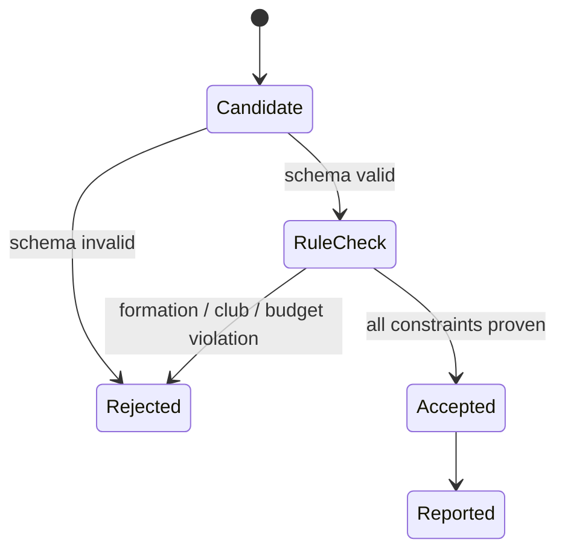

# FPL rules as code

## Rules are constraints, not model knowledge

An LLM may remember an old season, confuse FPL with another fantasy game, or generate an illegal
formation. The repository therefore keeps season rules in `rules/2026_27.yaml` and enforces them with
`RulesEngine`.

The current pack encodes:

- A squad of 15: two goalkeepers, five defenders, five midfielders, and three forwards.
- At most three players from one club.
- Eleven starters with exactly one goalkeeper, at least three defenders, at least two midfielders,
  and at least one forward.
- Up to five stored free transfers.
- A four-point cost for transfers beyond the free allowance.
- Season chip names and the 90-minute deadline metadata.

Always review the [official FPL rules](https://fantasy.premierleague.com/help/rules) before updating a
season pack.

## Validation boundary

The agent cannot turn a rejection into an acceptance. It can only request another calculation.

## Sale-price correctness

Suppose a player costs £7.8m in the market but your team can sell them for £7.6m. A transfer planner
that uses market price invents £0.2m of budget. The team snapshot therefore records `selling_price`,
and `RulesEngine.apply_transfers` refuses a payload that substitutes another value.

## Executable documentation

Tests are stronger than prose because they fail when behavior changes. `tests/test_rules.py` verifies
valid squads, unknown players, and insufficient budgets. Useful exercises are:

1. Add a test rejecting four players from one club.
2. Add a test rejecting two starting goalkeepers.
3. Add a versioned 2027/28 pack without changing the 2026/27 file.

## What is not encoded yet

Chip activation, carry-over behavior surrounding chip use, transfer deadlines, automatic
substitutions after matches, and postponed-fixture corrections are future rule-engine modules. The
MVP records enough chip metadata to avoid pretending those features are supported.
