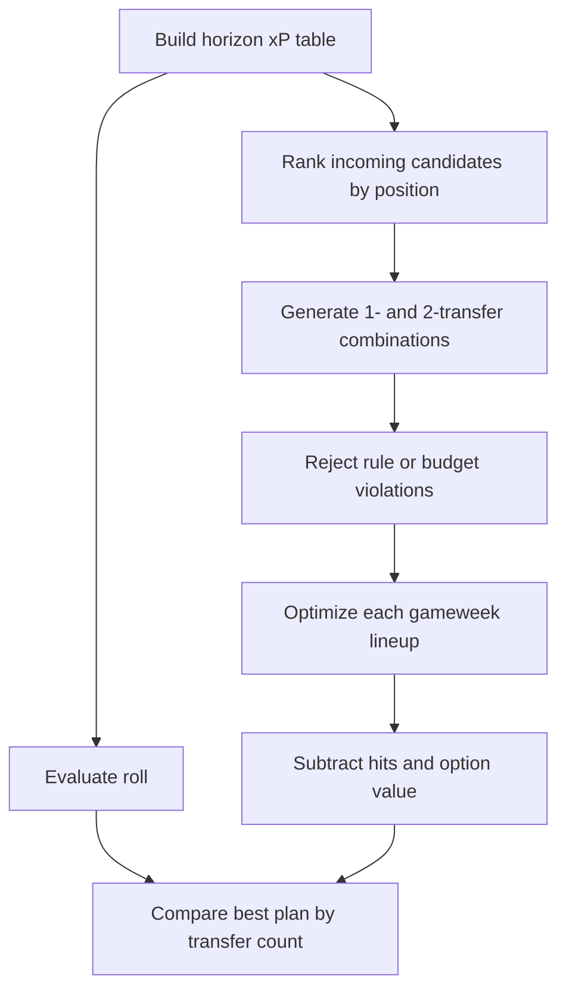

# Squad, transfer, and lineup optimization

## Objective

The MVP maximizes a transparent comparison score:

```text
objective = starting-XI-and-captain xP over horizon
          - confirmed transfer hits
          - 0.5 × transfers used
```

The final term approximates the option value of keeping a transfer. Without it, the solver spends a
free transfer for a tiny projected improvement even when uncertainty is much larger than the gain.

## Transfer search

The MVP evaluates:

- The current squad with zero transfers.
- Every legal outgoing player against the top incoming candidates at that position.
- Legal pairs of outgoing and incoming players for two-transfer plans.

Incoming pools are limited to the top eight horizon projections per position. This bounded
enumeration is easy to inspect and fast for a teaching project. It is not a mathematical proof of the
global multiweek optimum.



## Lineup optimization

For a valid 15-player squad, the optimizer checks every legal `(DEF, MID, FWD)` count totaling ten
outfield starters. For each formation it selects the highest projected players at each position, adds
one goalkeeper, then assigns captain and vice-captain.

Captain points are modeled by adding the captain's projection once more. The current vice-captain
choice is the second-highest projected starter. A later version should model captain non-appearance
and the conditional value of the vice-captain explicitly.

## Injury decision

For every flagged player, each plan returns one of:

- `transfer`: sold by that plan.
- `bench`: retained but excluded from the best XI.
- `start_with_risk`: reduced projection still earns a starting place.

A stronger future decision formula is:

```text
transfer value = replacement gain across horizon
               - point hit
               - saved-transfer option value
               - long-term value lost by selling
               - uncertainty penalty
```

## Moving to MILP

The next optimizer can introduce binary variables for owning, buying, selling, starting, captaining,
and using chips in each gameweek. HiGHS is a good open-source solver, including on Apple Silicon. Keep
the bounded solver as a reference implementation so complicated results can be checked against small
scenarios.
