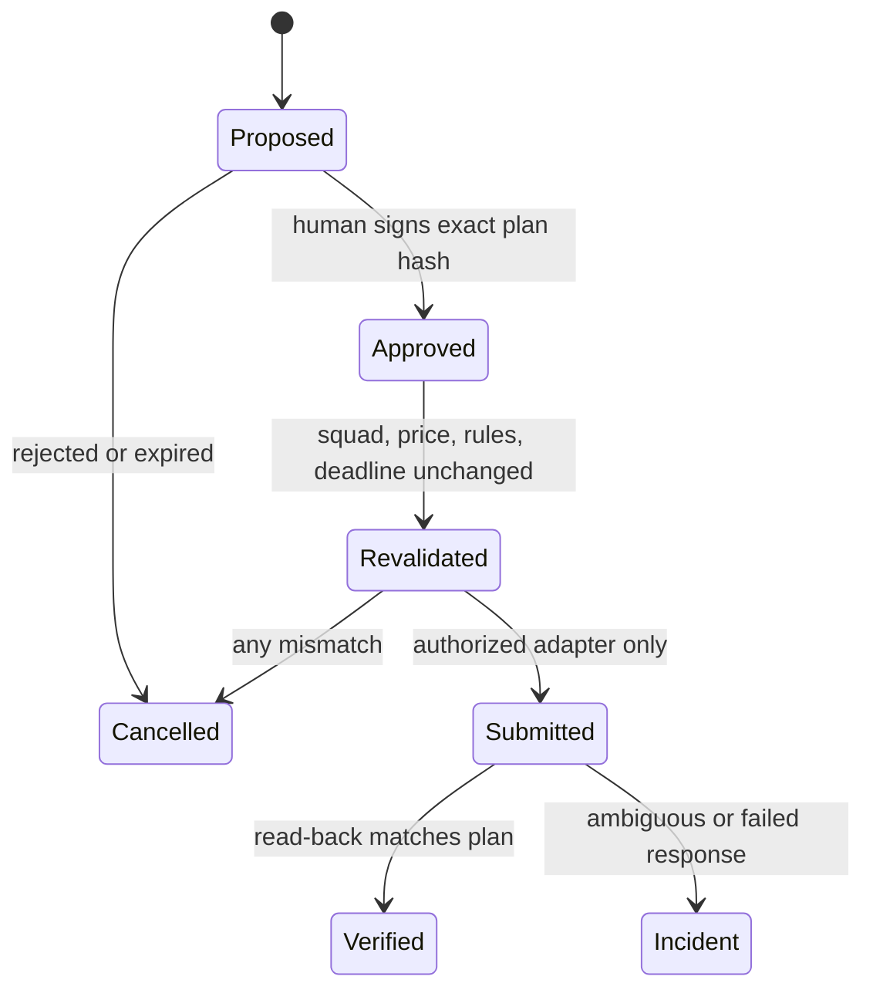

# Safety, security, and compliance

## Current boundary

As of September 11, 2026, the official FPL terms prohibit using automated systems to access the game
and extract information. They also require users to protect account access. The MVP therefore does not
automate the FPL site or its web endpoints.

Read the current sources yourself because terms can change:

- [FPL Terms & Conditions](https://fantasy.premierleague.com/help/terms)
- [FPL game rules](https://fantasy.premierleague.com/help/rules)
- [Premier League website terms](https://www.premierleague.com/en/terms-and-conditions)

An endpoint being visible in browser developer tools does not make it a supported public API, and
using browser automation does not turn prohibited automation into manual use.

## Threat model

| Threat | Example | MVP control |
|---|---|---|
| Secret disclosure | Token committed to Git | No account token required; private paths ignored |
| Prompt injection | Article says “ignore previous rules” | Web content is data; no web tool in MVP |
| Hallucinated injury | Model invents a six-week absence | Evidence fields and URLs supplied to tools |
| Illegal squad | Four players from one club | Deterministic `RulesEngine` rejection |
| Costly transfer | Model overlooks a four-point hit | Optimizer calculates hit from free transfers |
| Unauthorized action | Prompt asks model to submit | No mutation capability exists |
| Infinite loop | Model repeatedly calls tools | Eight-turn maximum |
| Stale information | Old article treated as current | Publication timestamp retained; freshness checks next |

## Two-phase execution design

If written authorization is obtained in the future, do not connect the model directly to a write
endpoint. Use a transaction-like gateway:

Additional controls should include an operating-system keychain, an explicit maximum point hit,
deadline buffers, idempotency tracking, audit logs, a global kill switch, and a default dry-run mode.

## Open-source hygiene

- Commit code and fictional fixtures, not proprietary data dumps.
- Do not use Premier League or club logos.
- Document every data provider's license and attribution.
- Keep real squad snapshots in `data/private/`.
- Review staged diffs before pushing.
- Enable GitHub secret scanning and private vulnerability reporting.

This is engineering guidance, not legal advice. Request written permission before adding automated
access to the game.
