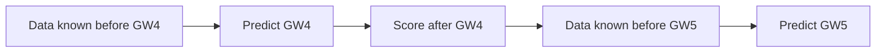

# Testing and evaluation

## Three systems need separate evaluation

```text
forecast quality != decision quality != agent quality
```

A good forecast can feed a bad optimizer. A good optimizer can be explained incorrectly by the model.
Measure each boundary.

## Current automated tests

| Test area | What it proves |
|---|---|
| Data | Files load and money uses exact integer units |
| Rules | Valid squads pass; unknown players and bad budgets fail |
| Projection | Easier fixtures score higher; blanks are zero; injuries reduce xP |
| Optimization | 0/1/2 plans exist, hits apply, and every lineup is legal |
| Harness | Only the intended read-only tools are registered |

Run:

```bash
pytest --cov=fpl_agent --cov-report=term-missing
ruff check .
```

## Forecast evaluation

Use rolling-origin backtests:



Never train on later gameweeks and test on earlier ones. Record mean absolute error, rank correlation,
appearance-probability calibration, and uncertainty coverage.

## Decision evaluation

Compare against baselines:

- Always roll the transfer.
- Pick the highest season-points players.
- Pick by recent form only.
- Use fixture difficulty only.
- The actual historical squad decision, when available from user-owned records.

Useful metrics include cumulative net points after hits, average projected gain, realized regret, team
value, and invalid action rate. The invalid action rate must remain zero.

## Agent evaluation set

Create fixed prompts for:

- A short injury with strong bench cover.
- A long injury with no viable bench.
- A blank gameweek.
- A double gameweek.
- Conflicting evidence timestamps.
- A request to break formation rules.
- A prompt-injection string inside player news.
- A request to claim an account change occurred.

Grade whether Qwen calls the correct tools and terminates normally. Treat its optional draft as an
evaluation artifact, not the plan. The default user-facing report must use names, mention uncertainty,
report the correct hit, cite supplied evidence, and refuse to claim execution because trusted code
renders it from the tool result.

## Reproducibility record

Each evaluated run should retain model name, model digest, prompt version, rules version, input hashes,
code commit, tool calls, and deterministic report. This lets you distinguish a model regression from a
data or algorithm change.
