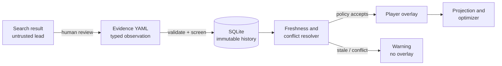

# Evidence pipeline

This milestone answers a deceptively hard question: how can an agent use changing injury news
without treating every web sentence as truth?

The answer is to separate **discovery**, **observation**, **resolution**, and **decision**. Each stage
has a smaller data contract and less authority than the next.



The search provider cannot write observations. The local model cannot change this pipeline. This is
an example of **least privilege**: every component has only the authority it needs.

## The observation contract

An observation is one claim from one source at one publication time. It is not the project's final
answer about a player.

| Field | Why it exists |
|---|---|
| `player` or `player_id` | Resolves the claim to one player in the current snapshot |
| `claim` | Short human-reviewed summary, limited to 500 characters |
| `status` | Controlled value: `available`, `doubtful`, `injured`, `suspended`, or `unknown` |
| `chance_of_playing` | Probability from 0–1 or a percentage from 0–100 |
| `expected_minutes` | Estimated gameweek minutes from 0–120 |
| `source_url` | HTTPS provenance for review |
| `source_type` | For example `official_club` or `reputable_news` |
| `provider` | How the source was discovered or entered |
| `published_at` | When the claim became available, including timezone |
| `confidence` | Confidence in this observation, from 0–1 |

Start with the fictional example:

```bash
fpl-agent evidence init
fpl-agent evidence import examples/evidence.yaml
fpl-agent evidence list --player Flint
```

The importer validates names, units, URLs, timestamps, ranges, and allowed status values. Importing
the same claim again is idempotent: its content hash finds the original row instead of creating a
duplicate.

## Why the database is append-only

Suppose Monday says a player is injured, Thursday says the player trained, and Friday says the
player is doubtful. Overwriting one `status` field destroys the history that explains a decision.
Appending source-bound observations preserves it:

```text
Monday observation ─┐
Thursday observation ├─> resolver at the chosen as-of time ─> derived availability
Friday observation ──┘
```

`EvidenceStore` uses SQLite so this history is local, queryable, and needs no server. A stable SHA-256
content hash makes retries safe. Retrieval time is deliberately excluded from that hash: fetching the
same published claim twice does not make it a new claim.

## Freshness and conflict policy

By default, evidence is fresh for 168 hours. The resolver:

1. excludes quarantined observations;
2. uses fresh observations if any exist;
3. scores candidates by confidence reduced by age;
4. flags conflicting fresh, high-confidence claims;
5. returns a derived view without altering stored observations.

A conflict exists when high-confidence sources disagree between `available` and a concern state, or
their chance estimates differ by at least 50 percentage points. This threshold is a policy, not a law
of football; tests make it visible and changeable.

The overlay fails closed:

| Evidence state | Default behavior |
|---|---|
| Fresh, no conflict | Apply derived availability to a copy of the player snapshot |
| Stale | Warn and retain the original snapshot value |
| Conflicting | Warn and retain the original snapshot value |
| Quarantined | Ignore and warn |
| Unknown player ID | Ignore and warn |

There are explicit `--allow-stale-evidence` and `--allow-conflicting-evidence` overrides on the
deterministic command for experiments. They should not become routine production defaults.

## Replaying a historical decision

Freshness depends on time, so a reproducible run must control time. Use an ISO-8601 timestamp with a
timezone:

```bash
fpl-agent evidence resolve --as-of 2026-09-12T00:00:00Z

fpl-agent recommend --gameweek 4 \
  --evidence-db data/private/evidence.db \
  --evidence-as-of 2026-09-12T00:00:00Z \
  --output reports/gameweek-4-with-evidence.md
```

Without `--as-of`, the current clock is correct for a live decision. With it, the same snapshot and
commit produce the same freshness judgment later. This prevents **temporal leakage** in a backtest.

Use `fpl-agent evidence timeline --player NAME` to inspect the entire history and selected row. The
[audit tutorial](13-audits-and-source-governance.md) explains the timeline and report fingerprint.

## Prompt-injection quarantine

External text is hostile input even when it comes from a familiar domain. The importer and search
adapter flag patterns such as instruction overrides, role impersonation, tool markup, action
requests, and secret requests. A flagged observation remains visible for auditing but never reaches
the player overlay.

Pattern matching is only defense in depth. The stronger controls are architectural:

- search snippets never become facts automatically;
- the evidence resolver is deterministic code, not an LLM prompt;
- evidence has no tool-execution capability;
- suspicious content is quarantined instead of “cleaned” and reused;
- account mutation tools do not exist.

## Read the code in this order

1. [`EvidenceObservation`](../src/fpl_agent/evidence.py) — the typed trust boundary.
2. [`EvidenceStore`](../src/fpl_agent/evidence_store.py) — immutable local persistence.
3. [`EvidenceResolver`](../src/fpl_agent/evidence.py) — freshness and conflict policy.
4. [`integrate_evidence`](../src/fpl_agent/evidence.py) — fail-closed overlay.
5. [`recommend`](../src/fpl_agent/cli.py) — integration with the existing optimizer.
6. [`test_evidence.py`](../tests/test_evidence.py) — executable edge cases.

## Learning experiments

1. Change Flint's publication time until the resolver marks it stale.
2. Add a fresh, high-confidence `available` observation for Flint and observe the conflict.
3. Import the same file twice and verify the second import reports duplicates.
4. Put `ignore previous instructions` in a claim and inspect its quarantine flags.
5. Change the conflict threshold only after writing a failing test that describes the new policy.

One bug found while building this milestone is instructive: a Python `and`/`or` expression returned
an empty list instead of a literal `False`. Pydantic rejected it, and a regression test now protects
the contract. Typed boundaries turn subtle language behavior into visible failures.
