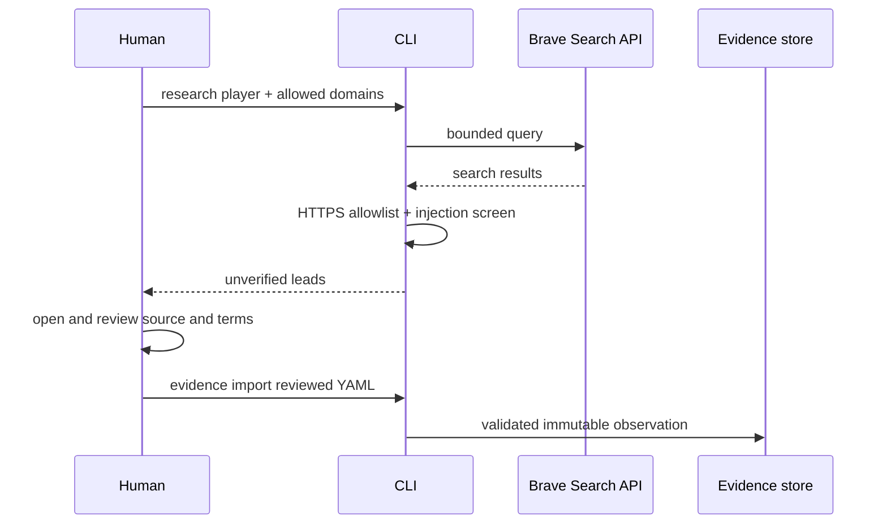

# Safe web research

The `research` command is a deliberately narrow web capability. It uses the Brave Search API to find
possible sources on domains you explicitly allow. It prints titles, URLs, and snippets for review; it
does not fetch result pages, extract player facts, or update the evidence database.



## Set up the provider

Create a Brave Search API key and keep it in your shell environment. The official quickstart warns
not to expose or commit the key.

```bash
export BRAVE_SEARCH_API_KEY='replace-with-your-key'

fpl-agent research \
  --player Flint \
  --allowed-domain example-club.invalid \
  --allowed-domain trusted-news.invalid
```

For repeated research, record review dates instead of repeatedly typing domains:

```bash
cp examples/research-sources.yaml data/private/research-sources.yaml
fpl-agent sources check data/private/research-sources.yaml
fpl-agent research --player Flint \
  --source-config data/private/research-sources.yaml
```

Only enabled, unexpired reviews enter the provider allowlist. The example domains use the reserved
`.invalid` suffix and are intentionally non-operational; replace them only after reviewing each real
source's current terms. See [Audits and source governance](13-audits-and-source-governance.md).

Do not put the key in a command-line argument, YAML file, Git-tracked `.env`, or model prompt. The CLI
only reads `BRAVE_SEARCH_API_KEY` from its environment.

The official API documents the `X-Subscription-Token` header, the web search endpoint, a maximum
query size of 600 characters/75 words, and a result count up to 20. The adapter enforces those query
and result limits:

- [Brave Web Search API reference](https://api-dashboard.search.brave.com/api-reference/web/search/get)
- [Brave Web Search API documentation](https://api-dashboard.search.brave.com/app/documentation/web-search)
- [Brave Search API quickstart](https://api-dashboard.search.brave.com/documentation/quickstart)

## Controls in the adapter

| Control | Purpose |
|---|---|
| Required domain allowlist | A result must come from a source you reviewed first |
| Expiring review registry | Prevent a historical terms decision from remaining valid forever |
| Exact/subdomain matching | `badexample.com` cannot impersonate `example.com` |
| HTTPS only | Reject malformed or clear-text links |
| FPL game-domain block | Preserve the project's no-automated-game-access boundary |
| Strict safe search | Reduce obviously unsuitable results |
| One-second request interval | Bound provider request rate within one process |
| Six-hour SQLite cache | Avoid repeating identical API calls |
| Injection scan | Label suspicious titles or snippets as quarantined |
| No page fetching | Keep discovery separate from ingestion and licensing decisions |

The allowlist is not a claim that a source is always correct. It records that you reviewed whether the
domain is relevant and permitted for your experiment. Re-check source terms before collecting or
redistributing content.

## Provider abstraction

`EvidenceProvider` is a small Python protocol:

```text
search(query, max_results) -> list[ProviderDocument]
```

This keeps the rest of the project independent of Brave. A future licensed sports-data adapter can
implement the same discovery contract while retaining its own authentication, attribution, rate, and
retention rules. Provider documents are still untrusted leads; changing provider does not change the
human-review boundary.

Read [`providers/base.py`](../src/fpl_agent/providers/base.py), then
[`providers/brave.py`](../src/fpl_agent/providers/brave.py), and finally
[`test_providers.py`](../tests/test_providers.py). The tests use a fake HTTP transport, so they verify
headers, filtering, quarantine, and caching without making network requests.

## From lead to observation

After reviewing a result, add a concise paraphrase to a private YAML file:

```yaml
observations:
  - player: Flint
    claim: Club update says the defender remains unavailable.
    status: injured
    chance_of_playing: 0.1
    expected_minutes: 5
    source_url: https://example-club.invalid/team-news
    source_type: official_club
    provider: brave_manual_review
    published_at: 2026-09-11T09:00:00Z
    confidence: 0.95
```

Then import and resolve it:

```bash
fpl-agent evidence import data/private/my-evidence.yaml
fpl-agent evidence resolve
```

The manual step is useful friction. It forces you to decide what the source actually supports, when
it was published, and how confident you are before it can affect a transfer recommendation.
