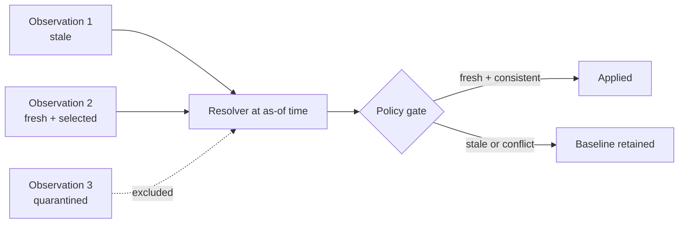
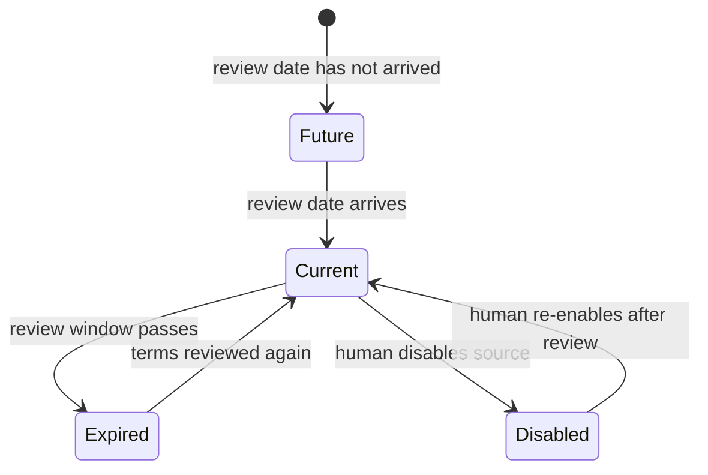

# Audits and source governance

Milestone 2.1 makes two earlier decisions inspectable over time:

1. Which exact evidence and resolver policy affected a recommendation?
2. Why was an external domain permitted for research on that date?

These are governance questions. The code does not decide whether a website's terms grant permission;
it records a human review, expires that review, and fails closed when the record is no longer current.

## Evidence timeline

Generate a chronological view for one player:

```bash
fpl-agent evidence timeline \
  --player Flint \
  --as-of 2026-09-12T00:00:00Z \
  --output reports/flint-evidence.md
```

The report labels every row as `fresh`, `stale`, `future`, or `quarantined` and shows which
observation the resolver selected. The derived result appears separately from the source claims.



This visualization is not another model summary. `render_evidence_timeline` receives typed
observations and deterministic resolver output. It escapes untrusted claims before placing them in a
Markdown table.

## Recommendation evidence audit

When `recommend` receives `--evidence-db`, both Markdown and JSON outputs include an evidence audit.
The JSON contract contains:

| Field | Meaning |
|---|---|
| `schema_version` | SQLite evidence schema used by the run |
| `as_of` | Clock instant used for freshness decisions |
| `max_age_hours` | Resolver freshness window |
| `allow_conflicts` / `allow_stale` | Explicit policy overrides |
| `observation_ids` | Stored rows present during the run |
| `observation_set_sha256` | SHA-256 fingerprint of the ordered typed observations |
| `quarantined_observation_ids` | Rows retained for audit but excluded from resolution |
| `unknown_player_observation_ids` | Rows that cannot map to this player snapshot |
| `player_resolutions` | Selection ID and applied/blocked outcome per player |

Run:

```bash
fpl-agent recommend --gameweek 4 \
  --evidence-db data/private/evidence.db \
  --evidence-as-of 2026-09-12T00:00:00Z \
  --json-output reports/gameweek-4.json
```

The fingerprint proves that two saved reports used the same serialized observation set. It is not a
digital signature and does not prove a source claim is true. Retrieval timestamps are part of the
fingerprint, so separately created databases may have different fingerprints even when their claims
look alike.

## Reviewed-source registry

`examples/research-sources.yaml` demonstrates the source-policy contract:

```yaml
version: 1
sources:
  - name: Fictional club newsroom
    domain: news.example.invalid
    terms_url: https://news.example.invalid/terms
    reviewed_at: 2026-09-11
    review_after_days: 180
    purpose: Discover official updates for manual review.
    enabled: true
```

Copy it into the ignored private-data directory and replace every fictional entry:

```bash
cp examples/research-sources.yaml data/private/research-sources.yaml
fpl-agent sources check data/private/research-sources.yaml
```

Each source moves through a small policy state machine:



Only `current` entries are sent to the Brave adapter. An expired or future-dated review is excluded
with a warning; a disabled entry remains visible but produces no warning. FPL game domains are
rejected by both the registry and the provider adapter.

Use the registry for research:

```bash
export BRAVE_SEARCH_API_KEY='replace-with-your-key'
fpl-agent research \
  --player Flint \
  --source-config data/private/research-sources.yaml
```

`--allowed-domain` still exists for a deliberate one-off query. It does not create a reusable review
record, so the registry is preferable for repeated work.

## Why reviews expire

Website terms, API products, robots rules, and licensing arrangements can change. A permanent boolean
such as `approved: true` silently turns a historical judgment into an eternal one. A review date plus
an expiry creates a visible maintenance obligation.

The registry records engineering policy, not legal truth. Before entering a source, a human must
read its current terms and decide whether the intended search, storage, attribution, and
redistribution behavior is permitted. This project does not provide legal advice.

## Read the code in this order

1. [`source_policy.py`](../src/fpl_agent/source_policy.py) — typed registry and expiry state.
2. [`evidence_reporting.py`](../src/fpl_agent/evidence_reporting.py) — deterministic timeline.
3. [`build_evidence_audit`](../src/fpl_agent/evidence.py) — fingerprint and policy record.
4. [`RecommendationReport`](../src/fpl_agent/models.py) — exported audit contract.
5. [`test_source_policy.py`](../tests/test_source_policy.py) — policy edge cases.

## Learning experiments

1. Set `review_after_days` to `1`, move `--as-of` forward, and observe the source expire.
2. Disable the current source and verify `research` has no configured domain to query.
3. Change one evidence confidence value, rerun, and compare fingerprints.
4. Add a conflicting observation and find its `blocked_reasons` in the JSON report.
5. Generate two timelines at different `--as-of` times and compare state labels.
