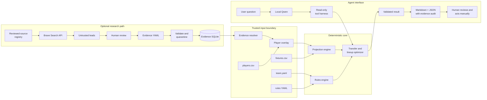
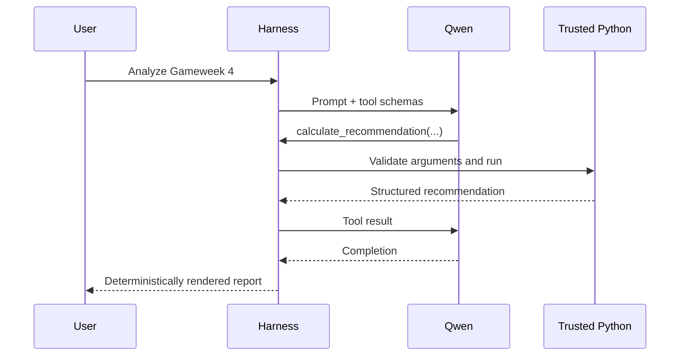

# FPL Agent: end-to-end visual guide

Start here. This chapter gives you the whole project in one place with minimal detail.

For a request-by-request example, open
[Follow one request: “Review my team for GW5”](15-gw5-request-walkthrough.md).

## The one idea to remember

```text
Qwen chooses tools and communicates.
Trusted Python code owns facts, rules, calculations, and safety.
The human owns external-source review and the final FPL action.
```

The project is an **advisory agent**. It recommends transfers and lineups, but it cannot log in or
change an FPL account.

## The complete system



## What each input means

| Input | Job |
|---|---|
| `players.csv` | Player price, position, form, availability, and baseline rates |
| `fixtures.csv` | Opponent, venue, difficulty, blanks, and doubles by gameweek |
| `team.yaml` | Your 15-player squad, bank, sale prices, and free transfers |
| `rules/2026_27.yaml` | Versioned squad, formation, budget, and transfer rules |
| `evidence.yaml` | Human-reviewed, source-bound availability claims |
| `evidence.db` | Immutable local observation history |
| `research-sources.yaml` | Domains reviewed for source discovery, with expiry dates |

All committed examples are fictional. Real private files belong in `data/private/`, which Git
ignores.

## One recommendation, step by step

| Step | What happens | Important output |
|---:|---|---|
| 1 | Load CSV/YAML through typed Pydantic models | Invalid fields stop the run |
| 2 | Read stored observations | Original evidence remains unchanged |
| 3 | Reject quarantined, future, stale, or conflicting evidence by default | Safe player overlay |
| 4 | Validate the current squad against season rules | Proven legal starting state |
| 5 | Project each player over the selected gameweek horizon | Expected points (`xP`) |
| 6 | Compare rolling, one transfer, and two transfers | Legal candidate plans |
| 7 | Optimize starting XI, bench, captain, and vice-captain | Best lineup per plan |
| 8 | Subtract transfer hits and saved-transfer value | Comparable objective score |
| 9 | Render trusted Markdown/JSON | Recommendation plus warnings and audit |

## The two calculations

Player projection:

```text
recent rate = 0.55 × points per game + 0.45 × form

fixture xP = recent rate
           × minutes factor
           × chance of playing
           × fixture difficulty
           × venue factor
```

Plan comparison:

```text
objective = starting-XI and captain xP across the horizon
          - transfer point hits
          - 0.5 × transfers used
```

These are teaching heuristics, not promises. Forecasting estimates player outcomes; optimization
chooses a legal plan from those estimates.

## How Qwen participates



Qwen can request five read-only tools:

- read the rules summary;
- validate the current team;
- find a player by name;
- inspect approved player evidence;
- calculate the recommendation.

Qwen is **not** the rules engine, projection calculator, optimizer, browser, or transfer executor.
Its free-form factual draft is hidden by default because local-model testing showed that correct tool
results can still be described incorrectly.

## How web information becomes usable

```text
search result ≠ evidence ≠ resolved availability ≠ decision
```

| Stage | Trust level | Can it change projections? |
|---|---|---:|
| Search title/snippet | Untrusted lead | No |
| Human-reviewed observation | Validated claim | Not yet |
| Fresh, consistent resolver result | Policy-approved estimate | Yes |
| Optimizer plan | Calculated advice | Produces recommendation only |

The resolver prefers fresh, high-confidence evidence. Suspicious instruction-like text is
quarantined. Strong disagreement produces a conflict. Stale or conflicting results retain the
baseline player data unless you deliberately use an override.

## Why the report is auditable

An evidence-backed report records:

- the `as-of` time and freshness window;
- every observation ID;
- the selected observation for each player;
- whether the resolver applied or blocked it;
- any policy override;
- a SHA-256 fingerprint of the complete observation set.

The fingerprint tells you whether two reports used identical serialized evidence. It does not prove
that the evidence itself was true.

## The main safety boundaries

| The project can | The project cannot |
|---|---|
| Read files you provide | Log in to your FPL account |
| Search reviewed domains through Brave | Scrape or automate the FPL game |
| Quarantine suspicious text | Guarantee every injection will be detected |
| Produce legal recommendations | Submit a transfer or lineup |
| Show evidence and uncertainty | Guarantee future points |

Security comes mainly from **least privilege**: dangerous capabilities do not exist in the tool
registry. Read [Safety, security, and compliance](08-safety.md) for the full boundary.

## Run the full fictional learning flow

```bash
# 1. Validate the fictional squad
fpl-agent validate

# 2. Create and fill the local evidence store
fpl-agent evidence init
fpl-agent evidence import examples/evidence.yaml

# 3. Inspect evidence at a reproducible time
fpl-agent evidence resolve --as-of 2026-09-12T00:00:00Z
fpl-agent evidence timeline --player Flint \
  --as-of 2026-09-12T00:00:00Z

# 4. Generate auditable advice
fpl-agent recommend --gameweek 4 \
  --evidence-db data/private/evidence.db \
  --evidence-as-of 2026-09-12T00:00:00Z \
  --output reports/gameweek-4.md \
  --json-output reports/gameweek-4.json

# 5. Let local Qwen select the recommendation tool
fpl-agent doctor --model qwen3:8b
fpl-agent agent --gameweek 4 --model qwen3:8b \
  --evidence-db data/private/evidence.db \
  --evidence-as-of 2026-09-12T00:00:00Z
```

`--as-of` is for replaying the dated fictional example. Omit it for live evidence.

## Where the important code lives

| File | Learn this |
|---|---|
| [`models.py`](../src/fpl_agent/models.py) | Typed contracts |
| [`rules.py`](../src/fpl_agent/rules.py) | Deterministic constraints |
| [`projection.py`](../src/fpl_agent/projection.py) | Expected-points calculation |
| [`optimizer.py`](../src/fpl_agent/optimizer.py) | Transfer and lineup search |
| [`evidence.py`](../src/fpl_agent/evidence.py) | Freshness, conflict, quarantine, and audit |
| [`source_policy.py`](../src/fpl_agent/source_policy.py) | Expiring source reviews |
| [`agent.py`](../src/fpl_agent/agent.py) | Qwen tool loop |
| [`cli.py`](../src/fpl_agent/cli.py) | End-to-end orchestration |

## What you should understand now

- An agent is a model plus tools, state, a loop, policies, and evaluation.
- LLM output is untrusted until deterministic code validates it.
- A search result is not automatically a fact.
- Forecasting and optimization are different problems.
- Rules belong in versioned code, not model memory.
- Historical runs need deadline-correct inputs and an explicit clock.
- Auditability requires provenance, observation IDs, policy settings, and fingerprints.
- More autonomy is not automatically better; authority should be deliberately limited.

## What comes next

Milestone 3 replaces teaching projection weights with fitted forecasting. It will require properly
licensed historical data, pre-deadline snapshots, separate minutes and points models, calibration,
and rolling backtests. The current deterministic projection remains the baseline to beat.
