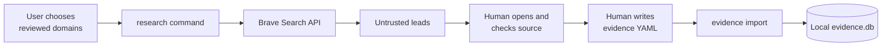
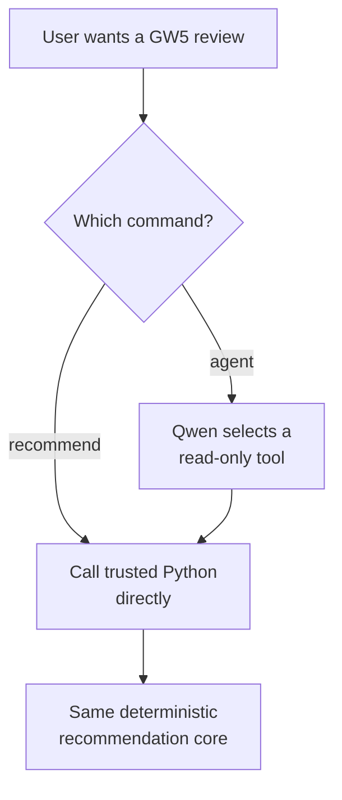
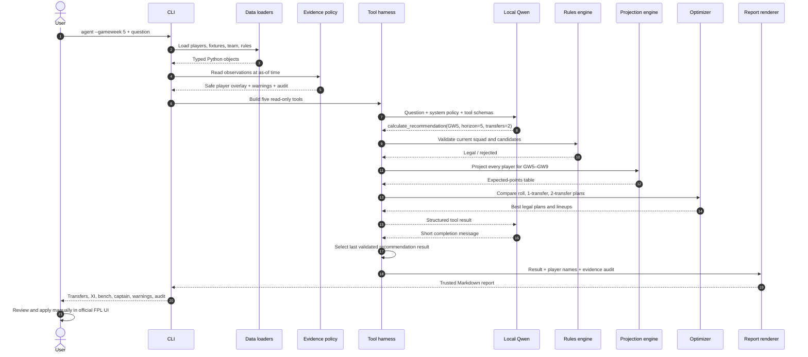
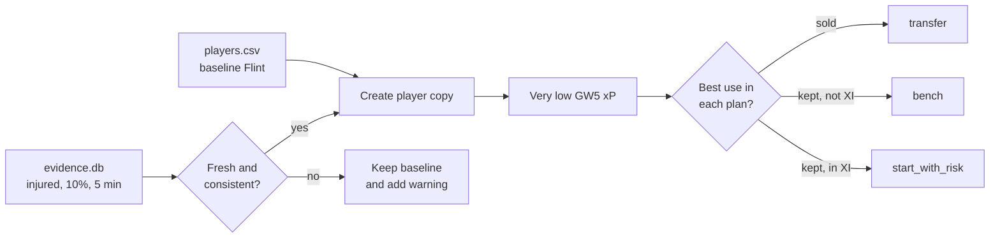
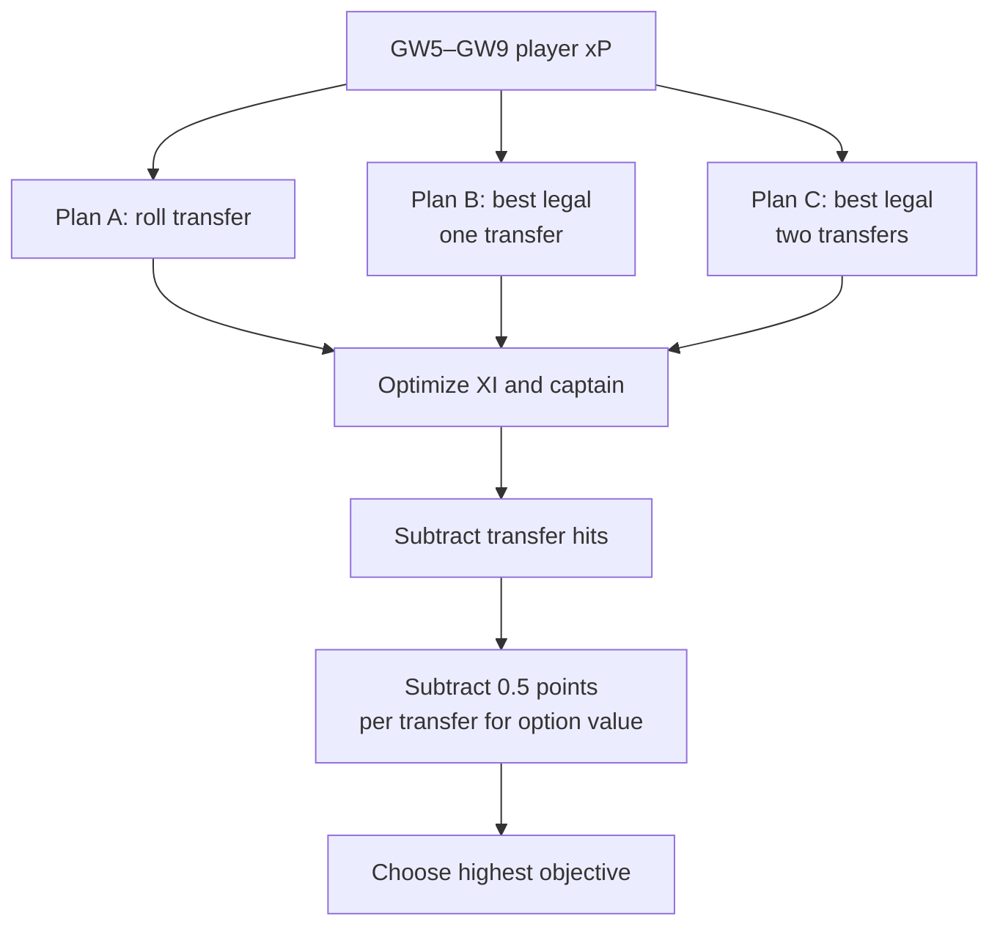
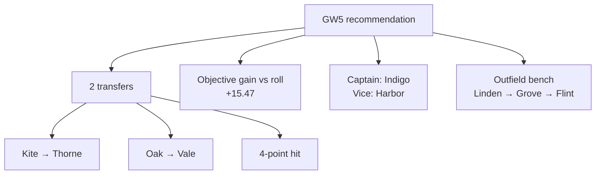
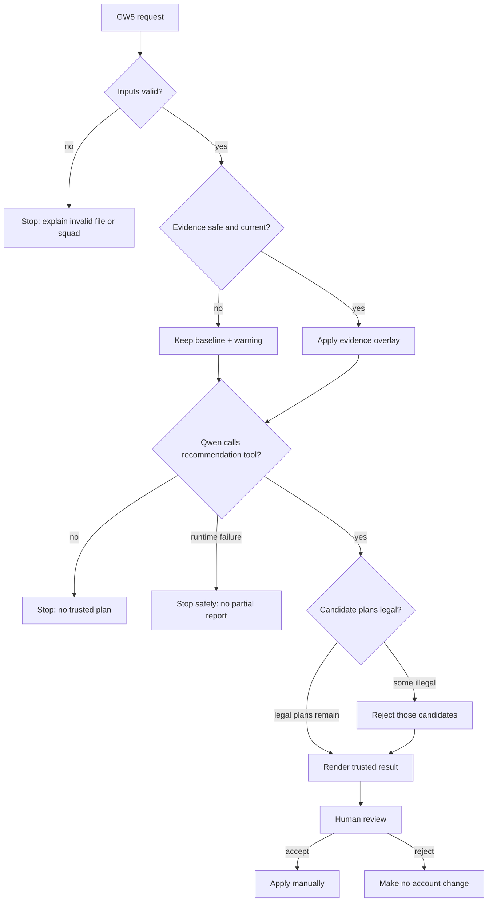

# Follow one request: “Review my team for GW5”

This chapter follows one user request through every component until the user receives a result.

## Before the question: prepare current evidence

The agent does **not** browse automatically during a review. Research and evidence approval are a
separate preparation phase:



Why the manual step? A search snippet may be wrong, stale, or malicious. It cannot become a player
fact by itself.

For the fictional walkthrough, prepare the database:

```bash
fpl-agent evidence init
fpl-agent evidence import examples/evidence.yaml
```

## Step 1: the user starts the GW5 review

The user runs:

```bash
fpl-agent agent --gameweek 5 \
  --prompt "Review my team. Recommend transfers, starting XI, captain and vice-captain." \
  --evidence-db data/private/evidence.db \
  --evidence-as-of 2026-09-18T00:00:00Z
```

This uses the Qwen route. There is also a direct deterministic route:



Use `recommend` when you only need the result. Use `agent` when you want to study model tool
selection. Both use the same rules, projection, and optimizer code.

## Step 2: the complete interaction

Read this sequence from top to bottom:



Qwen starts the calculation by choosing a tool. It does not calculate expected points, decide whether
a formation is legal, or write the final factual report.

## Step 3: what happens to one player

Follow fictional defender Flint through the run:



The evidence does not directly say “bench Flint.” It changes availability inputs. The projection
engine reduces Flint's expected points, and the optimizer decides whether transfer, bench, or risky
start is best for each plan.

## Step 4: how the optimizer builds the answer



For every candidate, the rules engine checks squad size, positions, club limits, budget, selling
prices, and legal formation. Illegal plans never reach the final comparison.

## Step 5: the fictional result the user sees

With the current example files and evidence evaluated at `2026-09-18T00:00:00Z`, trusted code returns:



The starting XI is:

```text
GK:  Alder
DEF: Dune, Cedar, Elm
MID: Indigo (C), Harbor (VC), Thorne, Juniper
FWD: Vale, Maple, Nova
```

These numbers are produced by fictional teaching data. They will change when the inputs or algorithm
change and are not real FPL advice.

## Step 6: how failure branches behave



Failing closed means uncertainty produces no automatic authority. A warning cannot silently become
permission to change the account.

## Step 7: what is inside the final result

| Report section | What the user learns |
|---|---|
| Decision summary | Recommended number of transfers |
| Compared plans | Roll, one-transfer, and two-transfer objective scores |
| Transfers | Exact sell/buy names and prices |
| Starting XI | Legal GW5 formation |
| Captain and vice-captain | Highest projected starting options |
| Bench | Reserve goalkeeper and ordered outfield substitutes |
| Availability decisions | Transfer, bench, or start-with-risk reasoning |
| Evidence audit | Observation IDs, selected rows, policy and fingerprint |
| Warnings | Uncertainty, stale/conflicting evidence, or unsupported scope |
| Agent audit | Number of Qwen tool calls and trusted-rendering statement |

The `agent` command prints Markdown. The `recommend` command can also save machine-readable JSON with
`--json-output`.

## Try it interactively

### Checkpoint A — inspect before asking Qwen

```bash
fpl-agent evidence timeline --player Flint \
  --as-of 2026-09-18T00:00:00Z
```

Before continuing, predict: will Flint start, sit on the bench, or be transferred?

### Checkpoint B — run without Qwen

```bash
fpl-agent recommend --gameweek 5 \
  --evidence-db data/private/evidence.db \
  --evidence-as-of 2026-09-18T00:00:00Z
```

Write down the transfers, captain, and objective score.

### Checkpoint C — run through Qwen

```bash
fpl-agent agent --gameweek 5 \
  --prompt "Review my team and calculate the best plan." \
  --evidence-db data/private/evidence.db \
  --evidence-as-of 2026-09-18T00:00:00Z
```

Compare it with Checkpoint B. The factual plan should match because Qwen calls the same trusted
service.

### Checkpoint D — make the evidence stale

Move the clock forward:

```bash
fpl-agent recommend --gameweek 5 \
  --evidence-db data/private/evidence.db \
  --evidence-as-of 2026-10-01T00:00:00Z
```

Find the stale-evidence warning and compare the plan. This shows that time is part of the input.

## The request in one line

```text
User question → typed inputs → evidence policy → Qwen tool choice → trusted calculation
→ deterministic report → human review → manual action
```

That is the complete end-to-end lifecycle of a GW5 request in the current project.
